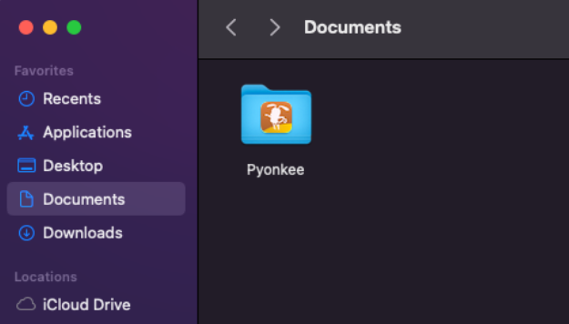
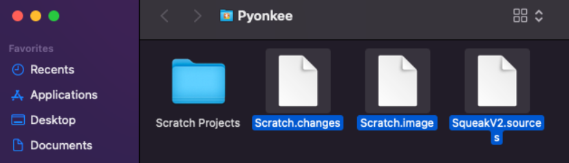
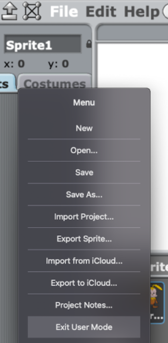
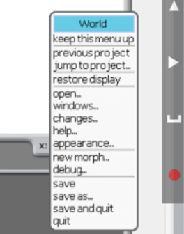
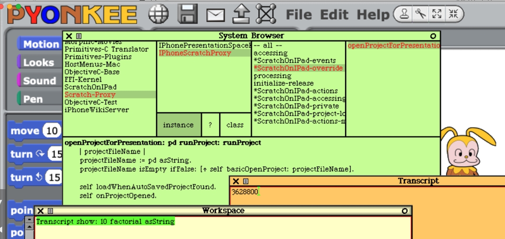
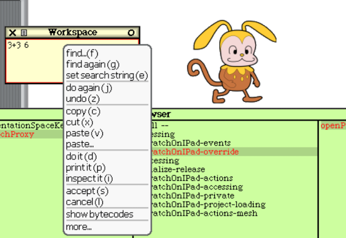

# Developing a Smalltalk Image

The core of Pyonkee runs as a virtual image on top of the Smalltalk VM.

Under normal circumstances, you cannot write to the virtual image because it resides inside the bundle. However, if you place the image in the local Pyonkee document folder, you can run Pyonkee in development mode.

In this mode, you can launch Smalltalk development tools, and even edit the core part that's written in Smalltalk. Moreover, you can add new instruction blocks and create your own original image.

The procedure is as follows:

## Placing the Original Image-Related Files into the Local Pyonkee Document Folder

On MacOS, you can find the *local* Pyonkee document folder in Finder (Note: this is not the Pyonkee folder on iCloud Drive).

Please copy the [Scratch.image](../Scratch.image), [Scratch.changes](../Scratch.changes), and [SqueakV2.sources](../SqueakV2.sources) files into this Pyonkee folder.

## Exiting User Mode

Now you can launch Pyonkee application as usual. Pyonkee will start with the newly placed Scratch.image.
In the "File" menu, select "Exit User Mode".

Pyonkee's main window will change to a non-full-screen mode. You can open the development menu by clicking on the background area.

By selecting "open...", you can access various development tools.

Feel free to write code as you wish! You can find more information about Smalltalk on the [Squeak.org](https://squeak.org/) website.

## Saving the Image

You can save your customized image by selecting "Save Image in User Mode" from the File menu. This way, all your changes are preserved. Have fun with it!

## Menus and shortcut keys

Not all shortcuts are implemented. Currently you can use:

| key | action |
| --- | --- |
| Command + click | open context menu |
| Command + double click | open halo |
| Command + a | select all |
| Command + z | undo |
| Command + x | cut |
| Command + c | copy |
| Command + v | paste |
| Command + d | do it |
| Command + p | print it |
| Command + i | inspect it |
| Command + b | browse it |
| Command + s | accept |
| Command + Shift + m | method definition |
